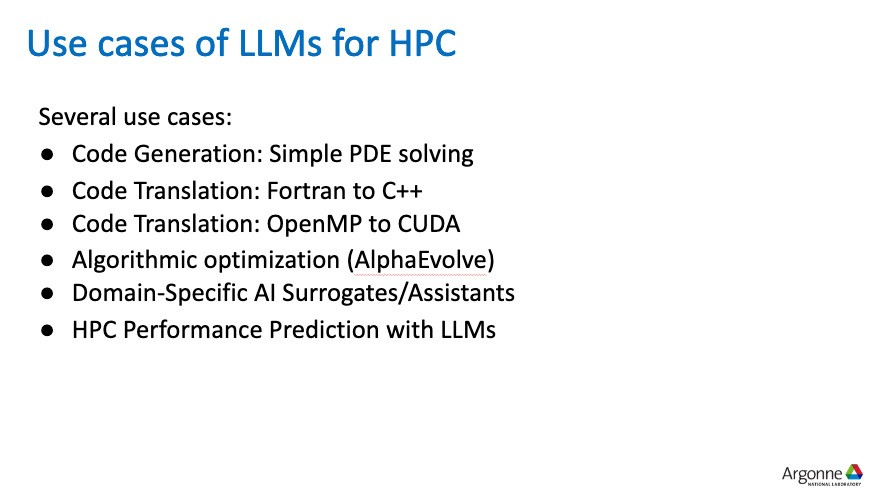
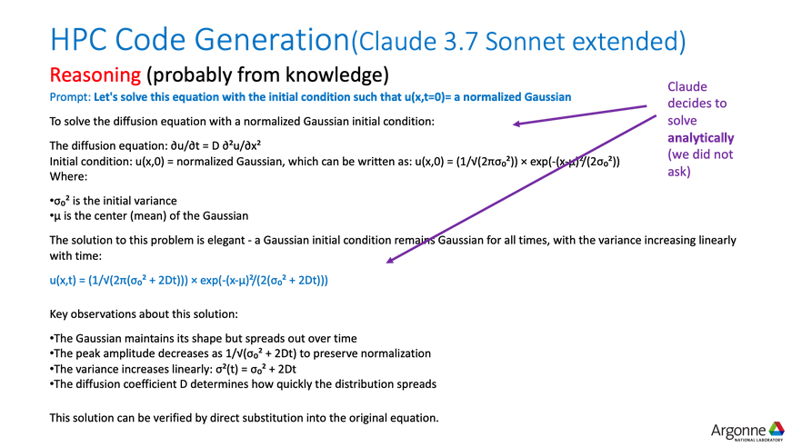
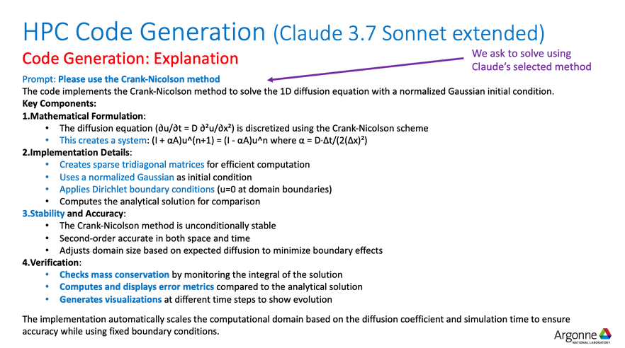
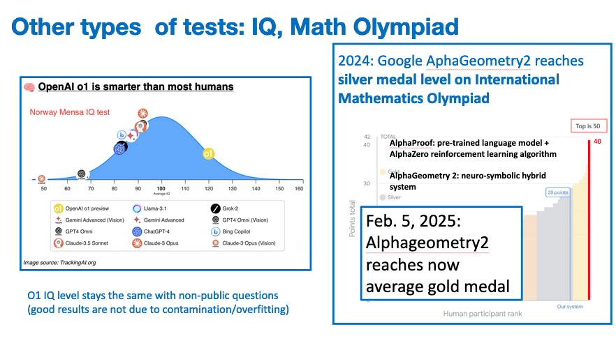
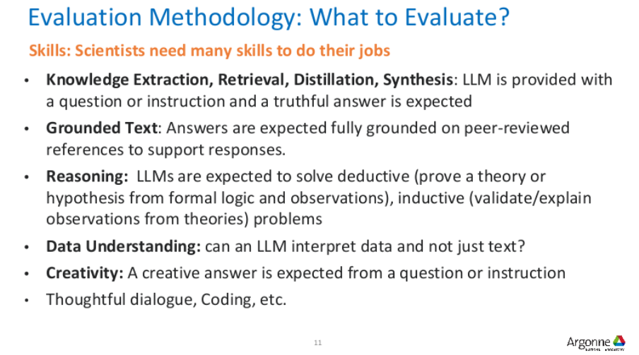
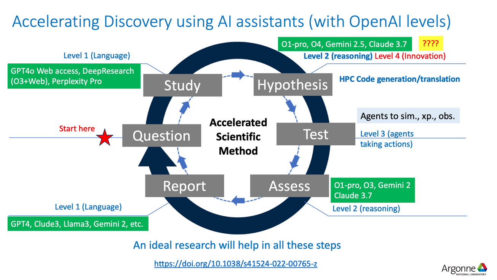
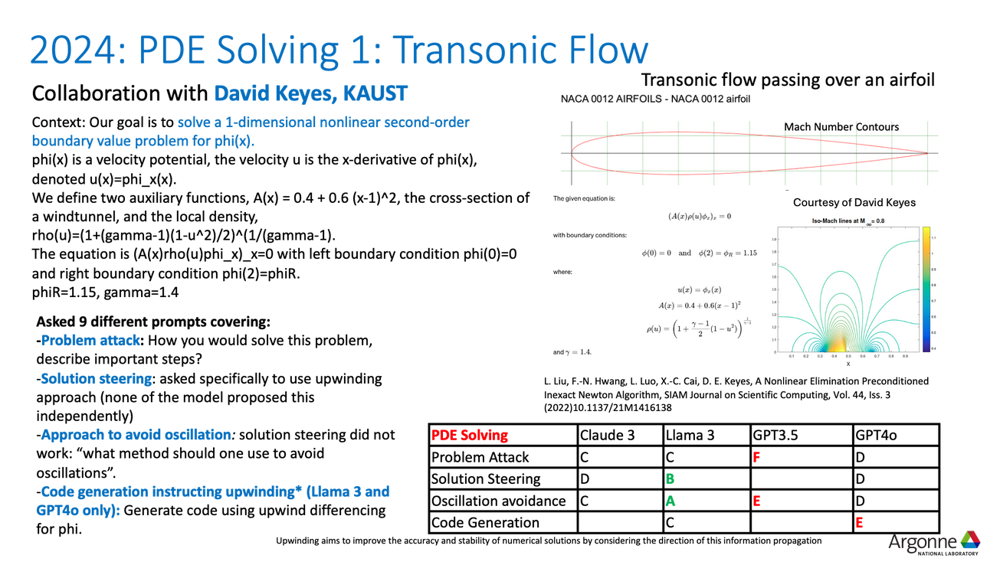
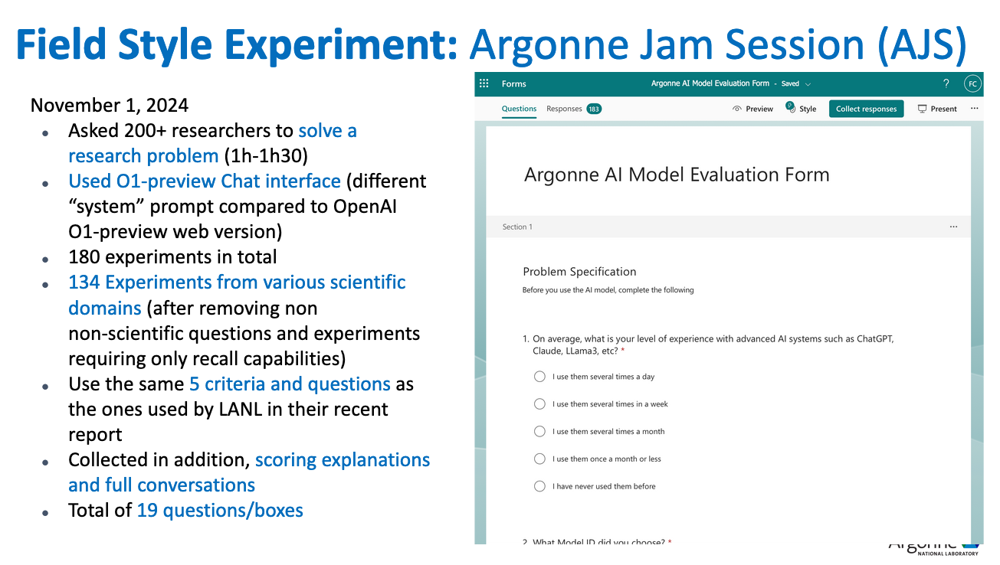

<!-- _class: centered -->

# Leveraging and Evaluating LLMs for HPC research

---

<!-- _class: centered -->

“Forty-two!" yelled Loonquawl. "Is that all you've got to show for seven and a half million years' work?"

"I checked it very thoroughly," said the computer, "and that quite definitely is the answer. I think the problem, to be quite honest with you, is that you've never actually known what the question is.” 

~ Douglas Adams, _The Hitchhiker's Guide to the Galaxy_

---

<!-- _class: centered -->

## Introduction to LLMs

---

## What are parameters?

- The weights, which control how information propagates between layers.

- The biases, which offset the values associated with the activation functions.

- Layer normalization weights.

- The embedding matrices, $W_{emb} \in \mathbb{R}^{|V|\times d}$, where $|V|$ is the size of the vocabulary and $d$ the dimensionality of the associated vector representation.

---

<!-- _class: centered -->

___

<!-- _class: centered -->

## LLMs in HPC

---

<!-- _class: centered -->

___

<!-- _class: centered -->

## How to efficiently produce a solution to a problem

###### Example applied to the linear heat diffusion equation.

---

<!-- _class: centered -->

___

<!-- _class: centered -->

___

<!-- _class: centered -->

___

<!-- _class: centered -->

___

<!-- _class: centered -->

___

## Main takeaways

1. Claude is capable to generate code that can solve the problem with a high level of accuracy (absolute error between $10^{-10}$ and $10^{-18}$).
2. It's an extremely easy problem, probably fished some solutions from *training memory*, therefore this is not as indicative as it might be regarding real world performance.
3. The process that took from beginning of the problem to solution involved a series of steps that made each task easier for the LLM.

---

<!-- _class: centered -->

## Interesting bit number 1
###### Using LLMs to do code translation and code optimization is surprisingly effective

---

<!-- _class: centered -->

___

<!-- _class: centered -->

___

## Achievements of AlphaEvolve

Found better algorithms for:

1. Data center scheduling,

2. Highly optimized arithmetic circuit for matrix multiplication in TPU,

3. Flash Attention kernel implementation in Transformer,

3. Matrix Multiplications (improved Strassen algorithm for 4x4) \[Nov25\].

---

<!-- _class: centered -->

## Prompting

---

<!-- _class: centered -->

___

## Few-shot prompting

Few-shot prompting means giving the LLM some examples of what kind of output we would like, based on some examples, to steer its responses towards the correct direction.

Few-shots is used also as a measurement of the performance of the model, usually this metric answers to the question 'How many hints did we have to give the LLM to make sure that its answer was right?'. There are many variation of this same metric that are more focused on how accurate the answer is based on the number of hints (like 0-shot and 1-shot).

___

<!-- _class: centered -->

## Interesting bit number two
###### How do we evaluate the performance of an LLM?

---

<!-- _class: centered -->

---

<!-- _class: centered -->

---

<!-- _class: centered -->

---

<!-- _class: centered -->

## The machine learning problem

Suppose we train a model $\mathcal{M}$ on a set $T$, when we analyze the performance of such model it's important that the dataset utilized $V$ doesn't contain samples from $T$, otherwise the model will already know the ground truth for such test samples and therefore the performance analysis will return an overconfident estimate of the model's capabilities.

---

## How to test

LLMs can be asked to reply to multiple choice questions or questions that require the generation of a short essay, this leads to an analysis of how how specific or broad the knowledge of the model is, as well as its ability to reason on a certain task.

Some classical ways of evaluating performance are:

- 0 shot evaluation,
- 1-5 shot evaluation (few shot),
- Joint performance evaluation for multiple choice,
- Multiple choice but split the answers in different prompts.

---

<!-- _class: centered -->

---

<!-- _class: centered -->

## LLM boosted research

---

## Handling uncertainty in LLMs

At the current stage of this technology uncertainty is a very important topic because:

1. LLMs hallucinate and tend on giving confident responses even if they have no clue what they are talking about.

2. Chain of thought and other frameworks suggest to use multiple different prompts to make the answer better, but what happens to the uncertainty of the answer? Since successive prompts are not independent from each other, how can we modellize uncertainty propagation?

---

<!-- _class: centered -->

---

<!-- _class: centered -->

## Research example on transionic flow

---

<!-- _class: centered -->

---

<!-- _class: centered -->

---

<!-- _class: centered -->

---

<!-- _class: centered -->

---

<!-- _class: centered -->

---

## Use AI to...

- Create rubrics to evaluate ideas and the code we have written.

- Generate testing code and boilerplate, maybe in conjunction with some python code.

- AI as a judge for our ideas, or using it to have a conversation with other papers (e.g. Stanford STORM \[Strm\]) generating roundtables that can be a valid alternative when talking with another person is not possible.

- Rewording, rephrasing and text correction.

- Enhanced Documentation crawler (albeit with the problem of not being up-to-date).

---

<!-- _class: centered -->

## If you want to, think alongside it, but don't make it think for you.

---

## Resources

**\[Nov25\]** :: Alexander Novikov et al.; *AlphaEvolve: A coding agent for scientific and algorithmic discovery* June 2025 Arxiv preprint [doi](https://doi.org/10.48550/arXiv.2506.13131)

**\[Strm\]** :: Stanford Storm [website](https://storm.genie.stanford.edu)
