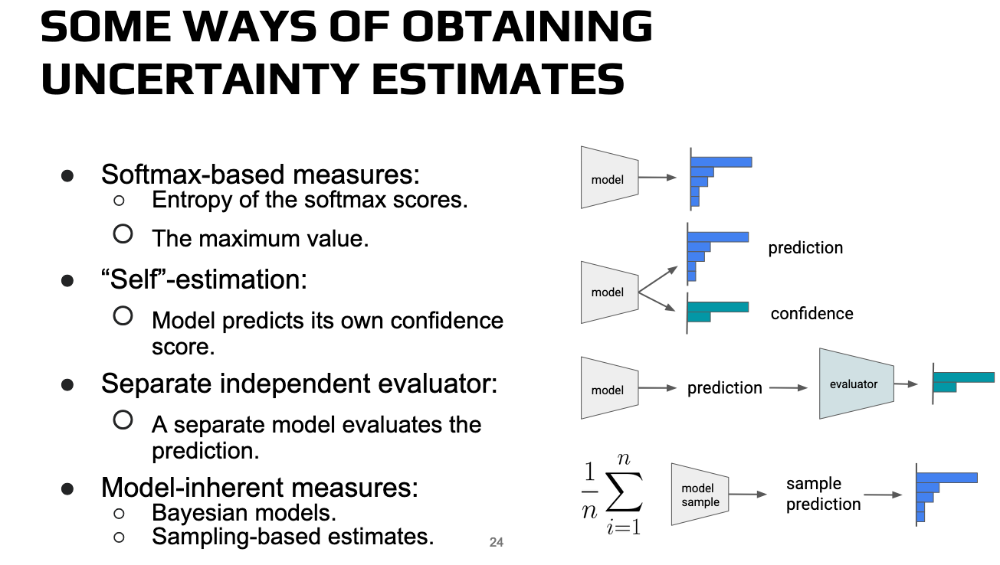

<!-- _class: centered -->

# My ISC conference

A recap of what I discovered during ISC attendance

---

## Table of contents

1. Leveraging and Evaluating LLMs for HPC Research

2. An Introduction to Developing Highly Parallel Applications Using C++ and SYCL

---

<!-- _class: centered -->

# 1. Leveraging and evaluating LLMs for HPC research

---

<!-- _class: centered -->

## Introduction to LLMs

---

<!-- _class: centered -->

---

<!-- _class: centered -->

---

## What are parameters?

- The weights, which control how information propagates between layers.

- The biases, which offset the values associated with the activation functions.

- Layer normalization weights.

- The embedding matrices, which are matrices $W_{emb} \in \mathbb{R}^{|V|\times d}$, where $|V|$ is the size of the vocabulary and $d$ the dimensionality of the associated vector representation.

---

<!-- _class: centered -->

## In autoencoder-decoder architectures *more parameters* = *more capabilities* but harder training phase.

---

## Multimodality

Now flagship models are boasting multimodal capacities, which translates to the possibility of the model to manipulate different forms of media:

- Text

- Audio

- Video

- Images

This can be done through the same A/D architecture by predicting the next most probable byte in the sequence (for example for images) another archetype that is rapidly gaining traction is the one of Diffusion Models.

---

<!-- _class: centered -->

___

<!-- _class: centered -->

## LLMs in HPC

---

<!-- _class: centered -->

___

<!-- _class: centered -->

## How to effectively generate code with LLMs

###### Reminder: if we are working with a language that doesn't have a high usage rate then the result is going to be heavily affected by that (e.g. newer c++ standards).

Example applied to the linear heat diffusion equation.

---

## Start by asking the LLM the heat diffusion equation in 1D

___

## Ask the LLM to provide a solution for the problem using an initial condition

___

## Ask the LLM to provide a numerical solution

___

## Ask the LLM to generate Python code for the chosen method

___

## It's possible to change the configuration by asking the LLM to utilize a different framework like PETSc

___

## Results

___

<!-- _class: centered -->

___

<!-- _class: centered -->

___

## Achievements of AlphaEvolve

Found better algorithms for:

1. Data center scheduling,

2. Highly optimized arithmetic circuit for matrix multiplication in TPU

3. Flash Attention kernel implementation in Transformer

3. Matrix Multiplications (improved Strassen algorithm for 4x4)

---

<!-- _class: centered -->

## Prompting

---

<!-- _class: centered -->

___

<!-- _class: centered -->

___

## Good prompting strategies

- Use special characters whenever we are prompting.

- Specify how long the response has to be.

- Specify the format of the output (e.g. it's possible to talk an LLM into outputting JSON).

- As we saw with the example of the heat diffusion it's important to decompose a complex task into a series of easier tasks, two classical approaches in this context are *prompt chaining* and *Chain of thought*.

---

<!-- _class: centered -->

___

<!-- _class: centered -->

___

<!-- _class: centered -->

___

## Few-shot prompting

Few-shot prompting means giving the LLM some examples of what kind of output we would like, based on some examples, to steer its responses towards the correct direction.

Few-shots is used also as a measurement of the performance of the model, usually this metric answers to the question 'How many hints did we have to give the LLM to make sure that its answer was right?'. There are many variation of this same metric that are more focused on how accurate the answer is based on the number of hints (like 0-shot and 1-shot).

___

<!-- _class: centered -->

## Performance evaluation

---

<!-- _class: centered -->

___

<!-- _class: centered -->

---

<!-- _class: centered -->

---

<!-- _class: centered -->

## The machine learning problem

Suppose we train a model $\mathcal{M}$ on a set $T$, when we analyze the performance of such model it's important that the dataset utilized to do so $V$ doesn't contain samples from $T$, otherwise the model will already know the ground truth for such test samples and therefore will make the utilizer overconfident in the model's abilities.

---

## How to test

LLMs can be asked to reply to multiple choice questions or questions that require the generation of a short essay evaluating how specific or how broad the knowledge of the model is, as well as its ability to reason on a certain task.

Some classical ways of evaluating the performance:

- 0 shot evaluation,
- 1-5 shot evaluation,
- Joint performance evaluation for multiple answer questions,
- Present the answers to the question separately.

---

<!-- _class: centered -->

---

<!-- _class: centered -->

---

<!-- _class: centered -->

## LLM boosted research

---

<!-- _class: centered -->

---

<!-- _class: centered -->

---

<!-- _class: centered -->

---

## Handling uncertainty in LLMs

At the current stage of this technology uncertainty is a very important topic because:

1. LLMs hallucinate and tend on giving confident responses even if they have no clue what they are talking about.

2. Chain of thought and other frameworks suggest to use multiple different prompts to make the answer better, but what happens to the uncertainty of the answer? How does it propagate between one prompt and the other?

---

<!-- _class: centered -->

---

<!-- _class: centered -->

## Research example on transionic flow

---

<!-- _class: centered -->

---

<!-- _class: centered -->

---

<!-- _class: centered -->

---

<!-- _class: centered -->

---

<!-- _class: centered -->

---

<!-- _class: centered -->

---

<!-- _class: centered -->

---
