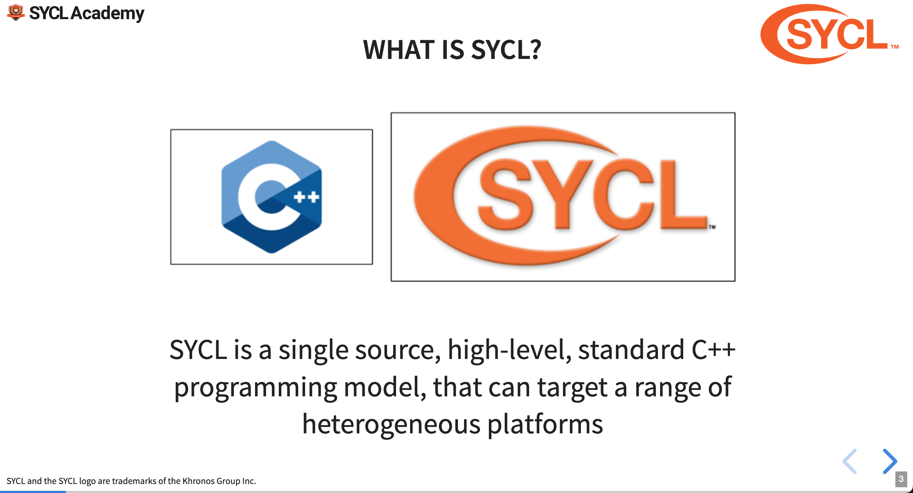
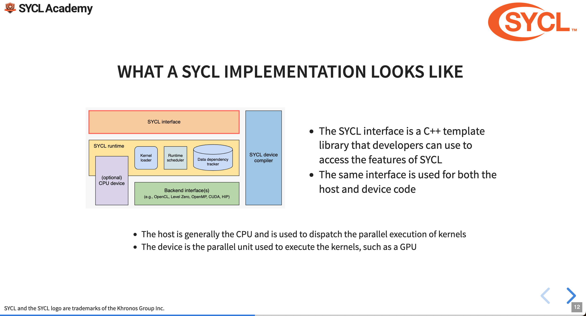
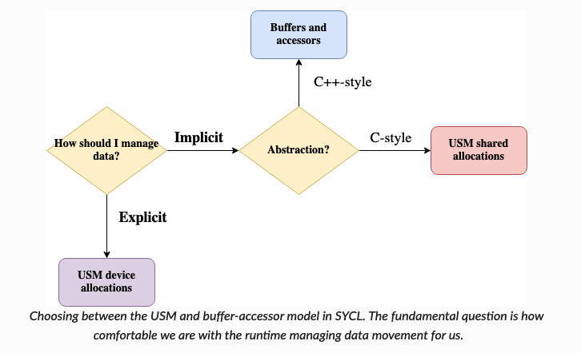

<!-- _class: centered -->

## An Introduction to Developing Highly Parallel Applications Using C++ and SYCL

---

<!-- _class: centered -->



---

<!-- _class: centered -->


---

## SYCL compilers

<div class="himg">
  <ul>
  <li> SYCL 2020 is based on the 2017 standard for C++. It has no `pragma`, language extensions or mandatory attributes.
  <li> Since SYCL is an open standard there are many different alternatives for the compilers, each comes with its own strengths and weaknesses (e.g. some compilers support CUDA, while others don't).
  </ul>
  
</div>

---

<!-- _class: centered -->



---

<!-- _class: centered -->


---

## SYCL programming model \[Enccs\]

- A _Queue_ dispatches work to our devices.
- _Actions_ is work that needs to be processed.
- Within the actions we execute _kernels_, which are executed asynchronously.

```c++
// Queue declaration
sycl::queue Q;
const auto size = /* Some size */
int *result = sycl::malloc_shared<int>(sz, Q);

// Adding an action to the queue
Q.parallel_for(
  range<1> { sz },
  [=] (id<1> tid) {
    result[tid[0]] -= 1;
  }
).wait()
```

---

## Memory models

SYCL has three different ways of managing data:
- buffer / accessor,
- Unified Shared Memory,
- Images, which are very similar to buffer / accessor and tailored to image processing.

---

## Buffer accessor model

The buffer / accessor model in SYCL leverages lazy memory movement so that information are passed to the device only once the device really needs them.

<div class="himg">
  
</div>

A buffer object “tells” the runtime how the data is laid out, the accessor “tells” it how we the memory is going to be read and written. Defining an accessor is equal to defining data dependencies between tasks \[Enccs\].

---

## Buffer accessor model, cont'd

The accessor requires:

- A buffer to read from,
- A handler,
- An access mode,
- A property list which affects the semantics of the accessor.

```c++
buffer<double> A{range{42}};

Q.submit([&](handler &cgh){
   // We discard any references to previous eventual previous values contained in the accessor
   auto aAA = accessor(A, cgh, write_only, no_init);
});
```


---

<!-- _class: centered -->


---

## Other USM operations

- Asynchronous `memcpy`
```c++
event queue::memcpy(void* dest, const void* src, size_t numBytes, const std::vector &depEvents);
```

- Synchronous `free`
```c++
void free(void* ptr, queue& syclQueue);
```

There are many more operations, which can be found on \[KrUSM\].

---

<!-- _class: centered -->



---

## SYCL execution model

SYCL's execution model rips off NVIDIA's execution model following a similar structure, this is not due to a lack of fantasy but it's done to make sure that the high-level abstraction is not forcefully connected to any specific vendor's.

- Single threads are renamed _work-items_, they are the smalles unit of processing.
- Work-items are grouped in _work-groups_, as for NVIDIA's blocks the number of work-groups that can concurrently operate on the machine is heavily dependent on resources used.
- Work-groups are clustered in _ND-ranges_.

---

<!-- _class: centered -->


---

## SYCL kernel as function object

SYCL kernels can be expressed either as lambdas or as function objects, kernel arguments are passed as capture targets or as data members.

```c++
class MyKernel {
  sycl::accessor input_;
  float* output_;

  MyKernel(sycl::buffer buf, float* output, sycl::handler& h)
    : input{buf.get_access(h)}, output_{output} {}

  // const is required
  void operator()(sycl::item<1> i) const {
    ; // computation here
  }
};
```

---

## SYCL kernel as a lambda function

```c++
  sycl::buffer buf = /* normal init */;
  float * output = sycl::malloc_device(/* params */);

  ... queue submit as normal ...

  auto acc = buf.get_access(h);
  auto func = [=](sycl::item<1> i) {
    acc[i] = someVal;
    output[i.get_global_linear_id()] = someOtherVal;
  });
  handler.parallel_for(range, func);
```

---

<!-- _class: centered -->


---

## Synchronization

- While SYCL allows synchronization within a work group, just like CUDA does with its synchronization primitives, SYCL doesn't allow the synchronization among different work groups in the nd-range.

- No synchronization is allowed between work-items.

---

<!-- _class: centered -->


---

## Accessing data with accessors

- Memory access for buffer / accessor can be done via raw pointers or nested subscript (e.g. `acc[x][y][z]`)

```c++
sycl::buffer<int> buf_a {a, dataSize};
sycl::buffer<int> buf_b {b, dataSize};
sycl::buffer<int> buf_r {r, dataSize};

q.submit([&] (sycl::handler& h) {
    sycl::stream out(1024, 256, h); 

    sycl::accessor a_acc {buf_a, h, sycl::read_only};
    sycl::accessor b_acc {buf_b, h, sycl::read_only};
    sycl::accessor r_acc {buf_r, h, sycl::read_write};

    h.parallel_for<class mykernel> (sycl::nd_range<1>{sycl::range{32}, sycl::range{64}}, [=](sycl::nd_item<1> i) {
        // Get the id of the work item in the global nd-grid
        sycl::id globalID = i.get_global_id();
        r_acc[globalID] = a_acc[globalID] + b_acc[globalID]; 
    });
}).wait()
```

---

<!-- _class: centered -->


---

<!-- _class: centered -->


---

<!-- _class: centered -->


---

## Resources

\[Enccs\] :: Heterogeneous Programming with SYCL; EuroCC National Competence Centre Sweden [website](https://enccs.github.io/sycl-workshop/what-is-sycl/) 
\[KrUSM\] :: Unified shared memory (USM); Khronos [website](https://github.khronos.org/SYCL_Reference/usm.html)
