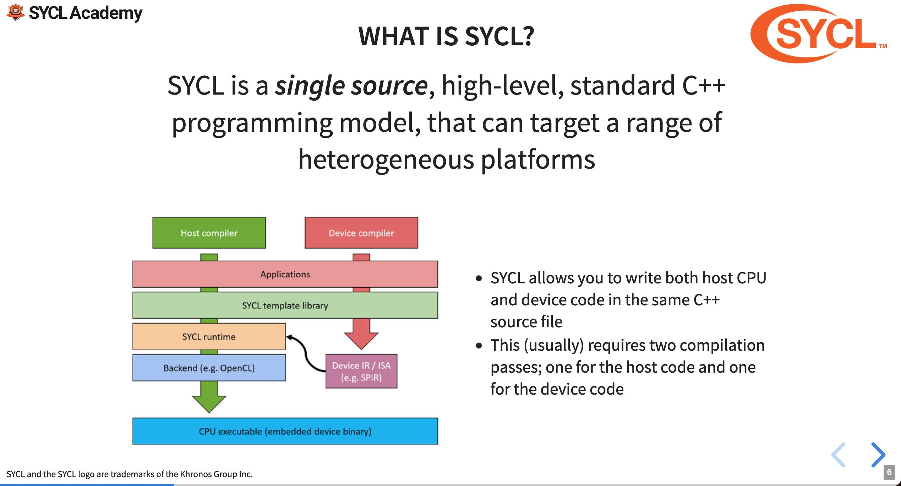
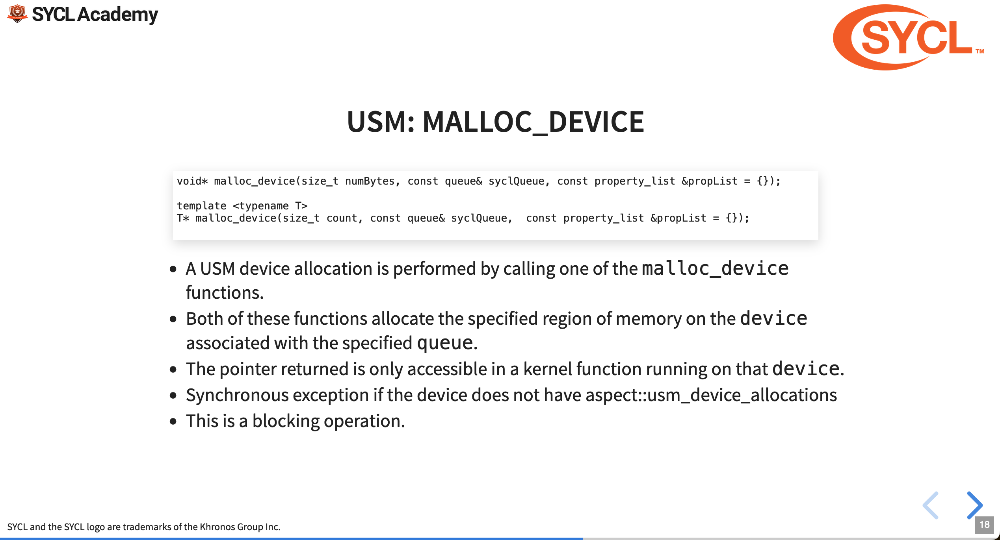

<!-- _class: centered -->

## An Introduction to Developing Highly Parallel Applications Using C++ and SYCL

---
## The tutorial

The speakers for the tutorial were part of different groups:

- [Rod Burns](https://www.linkedin.com/in/roderickburns/), from Codeplay Software,
- [Biagio Cosenza](https://www.cosenza.eu/), from University of Salerno,
- [Attila Krasznahorkay](https://inspirehep.net/authors/1070870), from University of Massachusetts Amherst,

Introduction to the SYCL programming model by heavy hands-on sessions.

The material shown during the lecture, and more, can be found on the Codeplay [github](https://github.com/codeplaysoftware/syclacademy) page.

---

## Outline

- Simple overview of the programming model

- Accessing memory
  - Buffer / Accessor
  - USM

- SYCL parallel scheme

- Defining Kernels

- Data dependency inference

- The Atlas example and conclusions

---

<!-- _class: centered -->

## Introduction to SYCL

---

<!-- _class: centered -->


---

<!-- _class: centered -->


---

<!-- _class: centered -->



---

<!-- _class: centered -->


---

## SYCL compilers

<div class="himg">
  <ul>
  <li> SYCL 2020 is based on the 2017 standard for C++. It has no <code>pragma</code>, language extensions or mandatory attributes.
  <li> Since SYCL is an open standard there are many different alternatives for the compilers, each comes with its own strengths and weaknesses (e.g. some compilers support CUDA, while others don't).
  </ul>
  
</div>

---

## SYCL programming model \[1\]

- A _Queue_ dispatches work to our devices.
- _Actions_ is work that needs to be processed, actions are associated to queues and therefore are assigned to specific devices.
- Within the actions we execute _kernels_, which are executed asynchronously.

```c++
// Queue declaration
sycl::queue Q;
const auto size = /* Some size */
int *result = sycl::malloc_shared<int>(sz, Q);

// Adding an action to the queue
Q.parallel_for(
  range<1> { sz },
  [=] (id<1> tid) {
    result[tid[0]] -= 1;
  }
).wait()
```

---

<!-- _class: centered -->

## Accessing data in SYCL

#### Buffer / accessors

---

## Memory models

SYCL has three different ways of managing data:
- buffer / accessor,
- Unified Shared Memory,
- Images, which are very similar to buffer / accessor and tailored to image processing.

---

<!-- _class: centered -->

## Interesting bit number 1
###### The buffer / accessor abstraction

---

## Buffer accessor model

The buffer / accessor model in SYCL leverages lazy memory movement so that information are passed to the device only once the device really needs them.

<div class="himg">
  
</div>

A buffer object “tells” the runtime how the data is laid out, the accessor “tells” it how we the memory is going to be read and written. Defining an accessor is equal to defining data dependencies between tasks \[1\].

---

## Buffer accessor model, cont'd

The accessor requires:

- A buffer to read from,
- A handler,
- An access mode,
- A property list which affects the semantics of the accessor.

```c++
buffer<double> A{range{42}};

Q.submit([&](handler &cgh){
   // We discard any references to previous eventual previous values contained in the accessor
   auto aAA = accessor(A, cgh, write_only, no_init);
});
```

---

## Accessing an accessor

Given a set of buffers

```c++
sycl::buffer<float, 1> buf_a (dA.data(), sycl::range<1>(dA.size()));
sycl::buffer<float, 1> buf_b (dB.data(), sycl::range<1>(dB.size()));
sycl::buffer<float, 1> buf_r (dR.data(), sycl::range<1>(dR.size()));
```

We can use the accessors by using the `sycl::id`, which represents a position within a nd-range (more on this later).

```c++
gpuQueue.submit([&](sycl::handler &cgh){
  sycl::accessor inA{buf_a, cgh, sycl::read_only};
  sycl::accessor inB{buf_b, cgh, sycl::read_only};
  sycl::accessor r{buf_r, cgh, sycl::write_only};
  cgh.parallel_for<add>(sycl::range<1>(dA.size()),
    [=](sycl::id<1> i){
    r[i] = inA[i] + inB[i];
  }); 
});
```

---

## Accessing an accessor, cont'd

Or we can use raw-pointers, which will be accessed using the 'manually' linearized id (the position is computed using row-major-order).

```c++
// Using the same buffers as before
gpuQueue.submit([&](handler &cgh){
  sycl::accessor inA{buf_a, cgh, sycl::read_only};
  sycl::accessor inB{buf_b, cgh, sycl::read_only};
  sycl::accessor r{buf_r, cgh, sycl::write_only};
  cgh.parallel_for<add>(rng, [=](sycl::item<3> i){
    auto ptrA = inA.get_pointer();
    auto ptrB = inB.get_pointer();
    auto ptrO = out.get_pointer();
    auto linearId = i.get_linear_id();
    ptrA[linearId] = ptrB[linearId] + ptrO[linearId];
  });
});
```

---

## Why should we care?

- Buffer accessor defines data dependencies between kernels for us, and is able to infer the structure of the dependency graph on its own based on accessor modes.
- The Buffer-accessor seems to be quite smart and work seamlessly as long as we are not doing anything too complicated.
- I would need to actually use SYCL for some time before being able to give a better analysis of the instrument.

---

<!-- _class: centered -->

## Accessing data in SYCL

#### Unified Shared Memory

---

<!-- _class: centered -->



---

## Other USM operations

- Asynchronous `memcpy`
```c++
event queue::memcpy(void* dest, const void* src, size_t numBytes, const std::vector &depEvents);
```

- Synchronous `free`
```c++
void free(void* ptr, queue& syclQueue);
```

There are many more operations, which can be found on \[2\].

---

<!-- _class: centered -->


---

<!-- _class: centered -->


---

<!-- _class: centered -->

## Parallelism in SYCL and memory access

---

## SYCL execution model

SYCL's execution model rips off NVIDIA's execution model following a similar structure, this is not due to a lack of fantasy but it's done to make sure that the high-level abstraction is not forcefully connected to any specific vendor's.

- Single threads are renamed _work-items_, they are the smalles unit of processing.
- Work-items are grouped in _work-groups_, as for NVIDIA's blocks the number of work-groups that can concurrently operate on the machine is heavily dependent on resources used.
- Work-groups are clustered in _ND-ranges_.

---

<!-- _class: centered -->


---

<!-- _class: centered -->


---

<!-- _class: centered -->


---

<!-- _class: centered -->


---

<!-- _class: centered -->

## Defining Kernels

---

## SYCL kernel as function object

SYCL kernels can be expressed either as lambdas or as function objects, kernel arguments are passed as capture targets or as data members.

```c++
class MyKernel {
  sycl::accessor input_;
  float* output_;

  MyKernel(sycl::buffer buf, float* output, sycl::handler& h)
    : input{buf.get_access(h)}, output_{output} {}

  // const is required
  void operator()(sycl::item<1> i) const {
    ; // computation here
  }
};
```

---

## SYCL kernel as a lambda function

```c++
  sycl::buffer buf = /* normal init */;
  float * output = sycl::malloc_device(/* params */);

  ... queue submit as normal ...

  auto acc = buf.get_access(h);
  auto func = [=](sycl::item<1> i) {
    acc[i] = someVal;
    output[i.get_global_linear_id()] = someOtherVal;
  });
  handler.parallel_for(range, func);
```

---

## Synchronization

While SYCL allows synchronization within a work group, just like CUDA does with its synchronization primitives, SYCL doesn't allow the synchronization among different work groups in the nd-range.

---

<!-- _class: centered -->


---

<!-- _class: centered -->


---

## Translation of the data flow

`kernel_a` and `kernel_b` access the same buffer `buf`, therefore a data dependency is constructed among the two devices, which are identified via the respective `sycl::handler`.

```c++
buf = sycl::buffer(data, sycl::range{1024});
gpuQueue.submit([&](sycl::handler &cgh) {
  // The accessor describes how data is accessed, the buffer infers data dependencies
  sycl::accessor acc {buf, cgh};
  cgh.parallel_for<kernel_a>(sycl::range{1024},
    [=](sycl::id<1> idx) {
      acc[idx] = /* some computation */
    }); });
gpuQueue.submit([&](sycl::handler &cgh) {
  sycl::accessor acc {buf, cgh};
  cgh.parallel_for<kernel_b>(sycl::range{1024},
    [=](sycl::id<1> idx) {
      acc[idx] = /* some computation */
    }); });
gpuQueue.wait();
```

---

<!-- _class: centered -->


---

<!-- _class: centered -->


---

<!-- _class: centered -->

## Closing thoughts and the CERN example

---

<!-- _class: centered -->


---

## Tracking \[4\]

Particle tracking is an extremely complicated topic. At its core the task consists in the numerical resolution of the equation of motion.
$$
\frac{d^2 \vec{r}}{ds^2} = \frac{q}{p} \left(\frac{d\vec{r}}{ds} \times \vec{B}(\vec{r})\right) = f\left(s, \vec{r}, \frac{d\vec{r}}{ds}\right)
$$

<div class="himg">
  
</div>

---

<!-- _class: centered -->


---

## Concluding thoughts

What should we consider when we talk SYCL?

- SYCL is open source and is a standard, tomorrow we could begin working on our own compiler, specifically tailored to our needs.

- If we are writing multi-platform code this could be a very good tool, but it comes with some evident drawbacks: (1) Since it's an open standard, there are many different SYCL distributions, (2) SYCL might perform worse than native counterparts (e.g. Native CUDA running on Nvidia GPU).

- On the bright side, SYCL is the parallelization technique used at CERN to abstract from the underlying hardware \[3\], if a research center as large as that one is willing to bet on SYCL, then there should not be any concerns as far as the future-proofness of the model.

---

## Resources

\[1\] :: Heterogeneous Programming with SYCL; EuroCC National Competence Centre Sweden [website](https://enccs.github.io/sycl-workshop/what-is-sycl/) 

\[2\] :: Unified shared memory (USM); Khronos [website](https://github.khronos.org/SYCL_Reference/usm.html)

\[3\] :: The Atlas Experiment Implements Heterogeneous Particle Reconstruction with Intel oneAPI Tools [website](https://atlas.cern/Discover/Detector/Software-Computing/Intel-Case-Study)

\[4\] :: Tracking in a Nutshell; Acts documentation [website](https://acts.readthedocs.io/en/latest/tracking.html)

---

## Accessing data with accessors

- Memory access for buffer / accessor can be done via raw pointers or nested subscript (e.g. `acc[x][y][z]`)

```c++
sycl::buffer<int> buf_a {a, dataSize};
sycl::buffer<int> buf_b {b, dataSize};
sycl::buffer<int> buf_r {r, dataSize};

q.submit([&] (sycl::handler& h) {
    sycl::stream out(1024, 256, h); 

    sycl::accessor a_acc {buf_a, h, sycl::read_only};
    sycl::accessor b_acc {buf_b, h, sycl::read_only};
    sycl::accessor r_acc {buf_r, h, sycl::read_write};

    h.parallel_for<class mykernel> (sycl::nd_range<1>{sycl::range{32}, sycl::range{64}}, [=](sycl::nd_item<1> i) {
        // Get the id of the work item in the global nd-grid
        sycl::id globalID = i.get_global_id();
        r_acc[globalID] = a_acc[globalID] + b_acc[globalID]; 
    });
}).wait()
```
