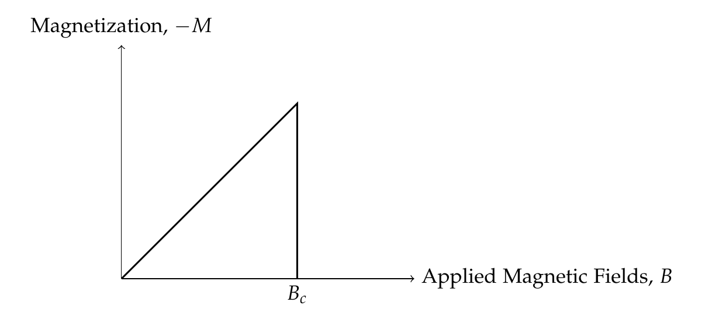
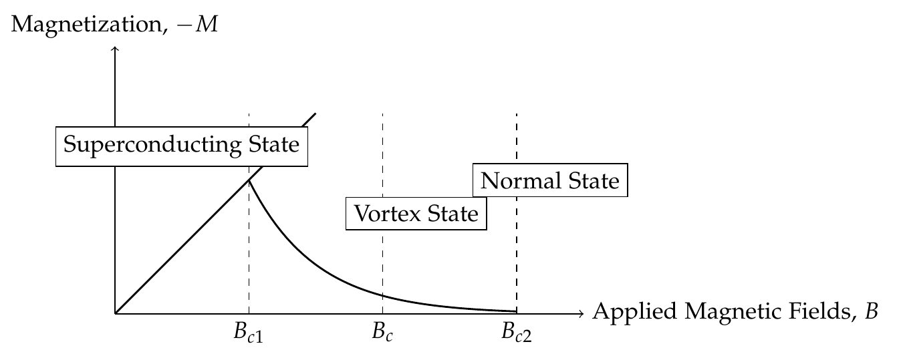
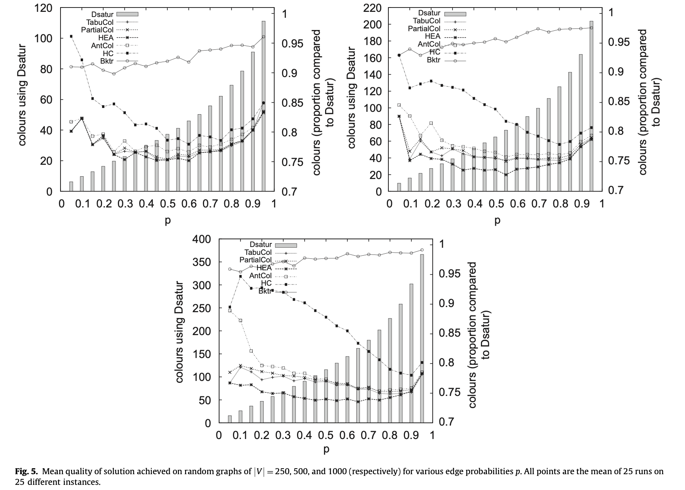

<!-- _class: centered -->

# Graph coloring

plus five words about myself

---

## Table of contents

1. Who am I? 
    A couple of words about me.

2. My master's thesis
    An overview of the work I did for my thesis.

3. Graph coloring
    Literature review for the topic I am interested in.

---

<!-- _class: centered -->

# 1. Who am I?

---

## Hallo! I'm

Alessandro Biagiotti, 

I just completed my Master's degree in computer science. I studied mostly: algorithms, parallel and distributed computing, ML and physics.

---

## My academic life

- 2018: Began my bachelor's in Computer Engineering, couldn't finish due to Covid19 struggles.

- 2020: Changed my bachelor's to computer science.

- 2022: Graduated with a thesis on Web Application development in team. In September I started my master's.

- 2023: Did my Erasmus in Heidelberg I attended a mix of courses in Computer Science, Scientific Computing and Physics.

- 2025: Graduated in Computer Science with a thesis on Machine Learning applied to Superconductor behavior.

---

## Three things I love and one I hate

1. I love trekking and climbing.

2. I love cinema and movies (one of my whole time favourites is *Ivan's childhood*).

3. I love to interact with people.

I am not the biggest fan of football.

---

<!-- _class: centered -->

# 2. My master's thesis

---

## Superconductors

Superconducting material can be of the first type (top image) or of the second type (bottom image) based on how the magnetization changes in response to the intensity of the applied magnetic field. Superconductors of the second type are usually employed in the field of high energy physics.

---

## The quench phenomenon

Superconducting material allows the passage of current with electrical resistance $R = 0$. Whenever a superconductor quenches it unpredicatbly transitions from the superconducting state to the normal conducting state. This change makes the electrical resistance $R > 0$, which can lead to costly consequences in the field of accelerator physics:

- Material destruction,

- Important economical and temporal losses,

- Beam loss,

- Potential damage to experiments.

---

## High order correctors

High order correctors is the family of souperconducting magnets we analysed for our experiments, they were:

- developed by INFN/LASA, to be installed on LHC for the high luminosity upgrade.

- designed to correct field errors introduced by the new Focusing quadrupoles.

 

    

---

## Large Hadron Collider

- Operational since 2009.

- Uses two counter-rotating proton beams that meet in one of the interaction regions (CMS, ATLAS, LHC-b, ALICE) at circa 14 TeV.

- Used for fundamental physics experiments.

- HiLumi is an update of the machine meant to increase the luminosity of the accelerator tenfold.

---

## My contribution

Using explainable machine learning models we tried to solve the following problems:

- Quench recognition: Identifying whether the magnet has quenched or not.

- Quench localization: If the magnet has quenched localize the quenched coils within the magnet assembly.

- Quench recognition +: Identify whether a specific coil within the magnet has quenched or not.

---

## The data

- The data consisted of $4$ different datasets describing the magnetic field quality measured after a quench event or after the magnet discharge.

- Each dataset consisted of $279$ data points divided in $15$ harmonics.

- The data describes the magnet behavior as a whole.

- The data was split in two sets: one of $250$ samples for experiments and one of $29$ points for testing.

---

## Performance evaluation

- Accuracy (Acc), fraction of correct predictions.

- Precision (Prc), number of true positives over number of positive predictions.

- Recall (Rec), number of true positives over the number of expected positives.

- Inverse recall (Irec), number of true negatives over the number of expected negatives.

- F1 score (F1), harmonic mean of Precision and recall.

- ROC AUC (RAUC), a good indicator of the quality of the model found.

---

## Decision trees for QRP

- High explainability,

- High degree of performance,

- Highly customizable structures.

    
    

---

## Performance for aggregate models

Decision trees already performed well, but we decided to look into different models to see if we could unlock better performing models. Thus we started looking into models aggregating trees.

- Random Forests were our first guess but they didn't provide a good enough performance improvement compared to the structure's complexity.

- Swapping the random feature sampling, characteristic of RFs, and moving to a model that constructs the forest picking the best available trees was a key idea that lead to better performance.

---

## Performance for aggregate models (cont'd)

- We compared the performance of the other models against an unexplainable benchmarcking model (SVC), known for the generally solid performance.

- Our 'informed-sampling' model proved to have very good performance in experiments and the final blind test showed that the performance extend to unseen scenarios.

    

---

## Solutions for QLP

-  We tried doing an extension of QRP solvers to QLP with little success (due to the complex nature of the multilabel problem).

- Our solution was to have a tree constructed on every coil to solve the QRP+ problem for that specific coil. Thus it was very important to make sure that the submodels were as easy as possible (the final model contains $4$ different submodels, one per coil).

- The results obtained using the scorer defined below were modest 
Experiments: $0.952 \pm 0.002$
Final test: $0.96 \pm 0.09$

$$
\mathcal{H}(y, \hat{y}) = 1 - \frac{h(y, \hat{y})}{4}
$$

---

## Conclusions

##### What we achieved
We found explainable ML models capable of solving QRP and QLP.

##### The limitations of our results
1. The scarsity of the available data is an important limitation for our results.
2. The results only apply to the particular family of High Order Correctors.

##### What we want to try in the future
1. Clustering.
2. High speed QRP and QLP solvers for online environments.
3. Fuzzy description of the quench event.

---

## Clustering example

---

<!-- _class: centered -->

# Graph coloring problem

---

## What is the graph coloring problem?

Given an undirected and unlabelled graph $G = (V, E)$, we say that a function $f$ is a *correct* coloring for $G \iff f(v) \neq f(u)$ for all $u$ and $v$ pairs of neighbouring vertices.

The minimum number of colors required to obtain a correct coloring for $G$ is known as the *chromatic number* for $G, \chi(G)$.

---

## GCP is a complex problem

- Deciding whether a graph is $k$ colorable is NP-complete.

- Finding the chromatic number $\chi(G)$ for a graph is NP-hard.

- Variations of the problem are also \#P complete (e.g. count the number of 
$3$-colorings in the graph).

---

## Some applications of GCP

1. Resource allocation tasks:

    - Assigning frequencies in networks,

    - Timetabling in problems (e.g. assigning rooms to exams),

    - Register allocations in compilers <a href="#footnote-1">\[1\]</a>.

2. Parallelising factorization steps (e.g. ILU factorization \[Nau15\]).

   

<h4></h4>

1. For more information about how this could be used check out Moritz's slides.

---

<!-- _class: centered -->

# Landscape of available CPU solutions

---

## Dsatur \[Bre79\]

Despite its age Dsatur has been proven solid and I consistently found it as a reference technique in the literature.

This method finds an exact coloring for bipartite graphs. It can be used as a lower bound on $\chi(G)$ since it begins coloring a maximal clique.

<code>
1. <u>Sort</u> all vertices in decreasing degree order.
 
 
2. <u>Color</u> a vertex of maximal degree with 1.
 
 
3. <u>Choose</u> a vertex of maximal saturation <a href="#footnote-2">[2]</a>.
 
 
4. <u>Color</u> the vertex with the least possible number.
 
 
5. <u>Loop</u> until all vertices are colored.
</code>

<h4></h4>

2. We define saturation of a vertex  the amount of neighbours that have been colored.

---

## Hybrid Evolutionary Algorithm \[Hao99\]

HEA for GCP was ideated by Galiner and Hao in 1999 and proved to be a successful algorithm to solve the problem.

The local optimization step is what sets it apart from more classical EA <a
    href="#footnote-3">[3]</a>.

<code>
1. <u>Generate</u> the initial population with a variant of <u>Dsatur</u>.
 
2. While there is no convergence or we are within a certain number of iterations:
  
3. Choose the parents from the population.
 
4. Perform crossover.
 
5. Perform L iterations of <u>Tabu Search</u>.
 
6. Update the population by removing the worse parent.
</code>

<h4></h4>

3. [Glass03] highlights that the algorithm remains a strong performer even if the local search component is removed.

---

## Crossover in \[Hao99\]

    

---

## Hill climbing heuristic \[Rhyd09\]

The Hill Climbing Heuristic combines Dsatur, local search and the first fit heuristic in a single package and tries to provide performance close to the ones obtained by HEA. 

<code>
1. <u>Generate</u> the initial solution for the problem &pi;.
 
2. Put a small part of the classes of &pi; in a new permutation &rho;.
 
3. Utilize a <u>local search technique</u> to make sure that both &pi; and &rho; remain feasible and do not increase the number of classes used.
 
4. <u>Append</u> &rho; to &pi;.
 
5. Do a <u>shuffle</u> of the obtained solution.
 
6. Run the <u>first fit heuristic</u> and go back to 2
</code>

---

## Comparison between HC, HEA and other algorithms found in literature

    

---

<!-- _class: centered -->

# Landscape of available GPU solutions

---

## Jones Plassmann Luby \[Plmn93\]

JPL is a classical coloring algorithm ideated in 1993 by Jones and Plassman, they interpreted the coloring as an independent set to use Luby's Monte Carlo approach capable of identifying an independent set in a graph in parallel.

<code>
1. Associate a random number to the vertices in the graph.
  
2. Construct an independent set I <u>in parallel</u>.
  
3. Color I <u>in parallel</u>.
</code>

---

## The JPL problem \[Bor23\]

    

---

## Cohen Castonguay \[Coh12\]

The Cohen-Castonguay algorithm is a different spin of JPL that modifies the procedure used to construct the independent set.

Instead of using memory to store the random number associated to each vertex we identify a set of $k$ different hash functions.

This approach is much faster than accessing memory, at the cost of having to choose a good number of hash functions $k$ as well as having to find a good heuristic to combine the coloring information (e.g. we could impose an ordering to the hash functions list).

---

## Atos framework \[Yux22\]

Atos is a task-parallel GPU dynamic scheduling framework that offers a solution to the three main performance bottlenecks of working with graphs:

- Small frontier problem,

- Load imbalance,

- Loss of concurrency opportunities.

The key aspects leveraged by Yuxin et al. are: Barrier relaxation, worker size, balancing data and task parallelism and kernel strategy (with either persistent or discrete kernel calls).

---

## Atos vs Gunrock \[Yux22\]

Atos is compared to the BSP framework Gunrock (which was first revealed in 2018), and the images below show a performance uplift, despite the good number of recalculations required by the nondeterministic approach of the framework.

Below we can see the compute time of different configurations for the Atos framework compared with a simulation of Gunrock (left), in ms, and the amount of repeated calculations due to speculation on the right.

    
    

---

## Atos (right) vs Gunrock (left)

    
    

---

## Sources

**\[Bre79\]** :: Brélaz, Daniel; *New methods to color the vertices of a graph* April 1979 Commun. ACM pp 251 - 256 [doi](https://doi.org/10.1145/359094.359101)

**\[Hao99\]** :: Galiner, Philippe; Hao, Jin-Kao; *Hybrid Evolutionary Algorithms for Graph Coloring* 1999 Journal of Combinatorial Optimization pp 379 - 397 [springer](https://link.springer.com/article/10.1023/A:1009823419804)

**\[Glass03\]** :: Glass, Celia A.; Prügel-Bennett, Adam; *Genetic Algorithm for Graph Coloring: Exploration of Galinier and Hao's Algorithm* September 2003 Journal of Combinatorial Optimization pp 229 - 236 [doi](https://doi.org/10.1023/A:1027312403532)

**\[Rhyd09\]** :: Rhydian, Lewis; *A general-purpose hill-climbing method for order independent minimum grouping problems: A case study in graph colouring and bin packing* 2009 Computers & Operations Research pp 2295-2310 [doi](https://doi.org/10.1016/j.cor.2008.09.004)

---

## Sources (cont'd)

**\[Plmn93\]** :: Jones, Mark T.; Plassmann, Paul E.; *A Parallel Graph Coloring Heuristic* 1993 SIAM Journal on Scientific Computing pp 654 - 669 [doi](https://doi.org/10.1137/0914041)

**\[Bor23\]** :: Borione, Alessandro; Cardone, Lorenzo; Calabrese, Andrea; Quer, Stefano; *An Experimental Evaluation of Graph Coloring Heuristics on Multi- and Many-Core Architectures* 2023 IEEE Access pp 125226-125243 [ieee](https://ieeexplore.ieee.org/document/10304117)

**\[Coh12\]** :: Cohen, J.; Castonguay, P.; *Efficient Graph Matching and Coloring on the GPU* 2012 GPU Tech., GTC on-demand

**\[Yux22\]** :: Chen, Yuxin; Brock, Benjamin; Porumbescu, Serban; Buluc, Aydin; Yelick, Catherine; Owens, John; *Atos: a task-parallel GPU scheduler for graph analytics* 2023 Proceedings of the 51st international conference on parallel processing, Association for Computing Machinery [doi](https://doi.org/10.1145/3545008.3545056)

---

## Sources (cont'd)

**\[Nau15\]** :: Naumov, M.; Arsaev, M.; Castonguay, P.; Cohen, J.; Demouth, J.; Eaton, J.; Layton, S.; Markovskiy, N.; Reguly, I.; Sakharnykh, N.; Sellappan, V.; Strzodka, R.; *AMGX: A library for GPU accelerated algebraic multigrid and preconditioned iterative methods* 2015 SIAM Journal on Scientific Computing pp S602-S626 [doi](https://doi.org/10.1137/140980260)

---

<!-- _class: centered -->

# Thank you for your time

Any questions?
